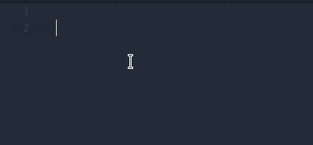
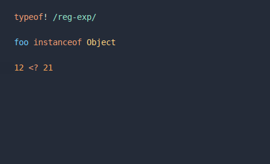

Language Server Protocol for LiveScript implemented as plugin for Atom editor.

Behind the scene it uses pluggable LiveScript [compiler](https://github.com/bartosz-m/livescript-compiler)

WIP!

Features:
- [x] diagnostics
- [x] autocompletion (simple)
- [x] hover (some operators only)
- [ ] code actions
- [ ] outline view
- [ ] data tips
- [ ] signature
- [ ] integration with live preview
- [ ] integration with build system

# Diagnostics
## Errors
File is on the fly compiled by LiveScript [compiler](https://github.com/bartosz-m/livescript-compiler) and any errors are reported.

# Autocompletion
Very limited at the moment only:
* keywords
* build-in types
* variables in current file

# Hover

# License 
**[BSD-3-Clause](License.md)**
